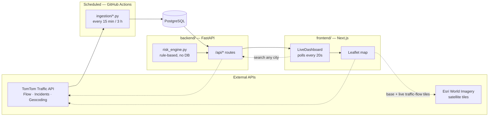
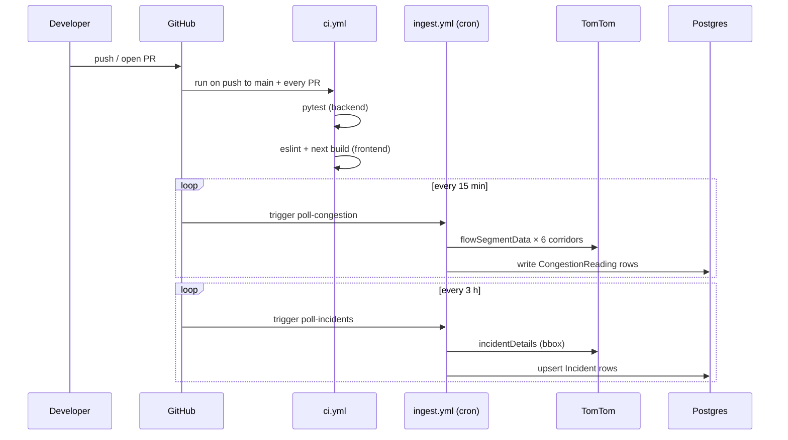

# Bengaluru Traffic Pulse

Root-cause analysis and live congestion tracking for Bengaluru's recurring festival-weekend
gridlock — grounded in [the Sep 11, 2026 exodus](data/case_study_sep11_2026.md), when a
second-Saturday + Sunday + Ganesh Chaturthi combination gridlocked every major exit corridor
from ~5 PM onward.

The project has three parts:

- **`backend/`** — FastAPI + Postgres. Serves live corridor congestion, active incidents, a
  rule-based risk calendar, the case study, and a solutions list at `/api/*`.
- **`ingestion/`** — standalone scripts that poll TomTom's Traffic API and write into the same
  Postgres database. Run on a schedule by `.github/workflows/ingest.yml`, not as a long-lived
  process.
- **`frontend/`** — Next.js dashboard that renders all of the above.

`data/` holds the evidence the backend and ingestion scripts read at runtime: corridor
coordinates, the Karnataka holiday calendar, and the case study itself — see
[`data/corridors.json`](data/corridors.json) for sourcing on each corridor.

## Explained simply — no coding background needed

Skip this section if you already write code; jump to [Tech stack](#tech-stack). This one's for
anyone who just wants to understand what the project actually does and how the pieces fit —
useful if you're explaining it out loud, or reading this before you've ever touched a codebase.

### The 30-second version

Six specific roads out of Bengaluru gridlock every time a long weekend and a festival line up —
it happened hard on Sep 11, 2026, and it's happened before. This project does three things about
that: it watches those six roads' traffic **right now**, using real data from a traffic company
(TomTom); it can tell you **which upcoming dates are risky**, using a simple checklist of rules
("is this a Friday before a 3-day weekend?"); and it lets you **check any road, anywhere in the
world**, on demand. All of that shows up as a website with a live map.

### The cast of characters — what each piece of technology actually is

Think of the whole system as a small factory. Something has to fetch the raw material, something
has to store it, something has to process it, and something has to display the finished product
to a customer. Each technology below plays one of those roles.

- **TomTom API** — TomTom is a company that makes GPS/maps products (you may have seen their
  hardware GPS units years ago). Behind the scenes they collect real speed data from millions of
  phones and cars on the road, and sell access to it. An "API" is just a way for one piece of
  software to ask another piece of software a question and get a structured answer back — no
  human, no webpage involved. This project asks TomTom three questions: *"how fast is traffic
  moving at this exact coordinate?"* (Flow Segment Data), *"what accidents/closures are near this
  area right now?"* (Incident Details), and *"what are the map coordinates of the place someone
  just typed?"* (Geocoding, used by the "search any location" box).
- **Python** — the programming language the backend and the data-fetching scripts are written in.
  Popular for exactly this kind of job (fetch data, do some math on it, save it) because it reads
  almost like plain English.
- **FastAPI** — a toolkit (a "framework") for building the backend in Python. The backend is the
  part of the system nobody sees directly: it's the "kitchen" that the website (the "dining room")
  places orders with. When your browser asks "what's the traffic on Hosur Road?", FastAPI is what
  receives that question, figures out the answer, and sends it back in a predictable format.
- **PostgreSQL** ("Postgres") — a database: a highly organized digital filing cabinet. Every time
  the system fetches new traffic data, it doesn't just show it and forget it — it files it away
  with a timestamp, so later it can answer "what did traffic look like over the last 24 hours?"
  by pulling the relevant filed rows back out.
- **Docker / Docker Compose** — a way to package software (like Postgres) so it runs identically
  on any computer, without anyone having to manually install and configure it. `docker compose up`
  is roughly "unpack and start the filing cabinet, exactly as configured, no setup required."
- **Next.js + React** — the toolkit the *website itself* (what you see and click on) is built
  with. React is a way of building a page out of reusable pieces ("components": a map, a search
  box, a stat card); Next.js is the surrounding toolkit that turns those pieces into an actual
  running website with pages and navigation.
- **TypeScript** — JavaScript (the language nearly every website runs on in your browser) with an
  extra safety layer: it catches a category of bugs — like accidentally treating a piece of text
  as if it were a number — before the code ever runs, instead of the website breaking for a real
  visitor.
- **Tailwind CSS** — a toolkit for styling: colors, spacing, rounded corners, dark mode. Instead
  of writing custom styling rules from scratch for every element, you describe what you want in
  short, reusable labels.
- **Leaflet + Esri + TomTom map tiles** — the satellite map on the dashboard isn't one company's
  product; it's three pieces stacked on top of each other. Leaflet is the library that makes an
  interactive, drag-and-zoom map possible on a webpage at all. Esri supplies the actual satellite
  photography underneath. TomTom supplies a second, semi-transparent layer on top that paints
  every road a color based on how congested it is *right now* — the same live-flow data product
  used by TomTom's own consumer maps.
- **GitHub Actions** — an automation robot that lives inside GitHub (where the code is hosted). It
  runs small jobs on a timer without any human starting them: every 15 minutes it asks TomTom for
  fresh traffic numbers and files them away; every 3 hours it checks for new incidents; on every
  code change it re-runs the automated tests, to catch mistakes before they reach the live site.

### Follow one piece of data, start to finish

**Scenario 1 — a scheduled update (this happens automatically, nobody's watching):**

1. Every 15 minutes, GitHub's automation robot wakes up and runs a small Python script.
2. That script asks TomTom, one at a time, for all six roads: *"what's the current speed here?"*
3. TomTom answers with numbers: current speed, and what the speed *would be* with no traffic at
   all (free-flow speed).
4. The script does simple math — current time ÷ free-flow time — to get a congestion ratio (1.0x
   = normal, 2.0x = taking twice as long as it should) and files the result into the database with
   a timestamp.
5. Nothing else happens yet — this just keeps the filing cabinet current.

**Scenario 2 — you open the dashboard:**

1. Your browser loads the website and asks the backend: *"what's the latest reading for each of
   the six roads?"*
2. The backend looks in the database's most recent filed rows (from Scenario 1) and sends them
   back as data.
3. The website draws that data as colored map pins, a ranked bar list, and stat cards — and then
   quietly repeats step 1-3 every 20 seconds in the background, so the numbers stay current
   without you refreshing the page.

**Scenario 3 — you type a city into "Check any location":**

1. Your browser sends what you typed straight to the backend.
2. The backend asks TomTom's Geocoding service: *"what place is this text talking about, and
   where is it on the map?"*
3. TomTom answers with a place name and coordinates. The backend immediately asks TomTom a second
   question with those exact coordinates: *"how's traffic here, right now?"*
4. The backend hands both answers back to your browser in one response, and the map flies to that
   spot and drops a pin. **Nothing here touches the database** — it's a live round-trip, not
   filed away, which is deliberate: it keeps this on-demand feature from eating into the
   scheduled updates' quota with TomTom.

**Scenario 4 — the risk calendar:**

This one never calls TomTom at all. It reads a spreadsheet-like file of Karnataka's public
holidays (`data/events_calendar.csv`) and runs it through a checklist of plain rules — see
[Why rule-based, not ML](#why-rule-based-not-ml) below for why it's a checklist and not an AI
model.

### Questions a beginner would probably ask

- **Is any of this AI?** No. Every number on this dashboard is either a direct read from TomTom's
  traffic data or simple, human-written arithmetic on top of it. The risk calendar is a checklist
  of rules a person wrote by hand, not a trained model.
- **Does this cost money to run?** TomTom's free tier is enough for this project's scale (six
  roads, polled every 15 minutes) — see [Workflows](#workflows) for the exact quota math. Postgres
  and GitHub Actions are free at this scale too.
- **What actually happens if TomTom is down or the key is missing?** The website doesn't crash —
  it just shows "no readings yet" where live numbers would normally be. That was a deliberate
  design choice, not an accident.
- **Where do the six specific roads come from?** They're not arbitrary — they're the exact roads
  named in real news coverage of the Sep 11, 2026 gridlock. See
  [`data/corridors.json`](data/corridors.json) for the source link behind each one.

## Tech stack

| Layer | Choices |
|---|---|
| **Backend** | Python, FastAPI, SQLAlchemy 2.0, Pydantic v2 / pydantic-settings, PostgreSQL, httpx, pytest |
| **Frontend** | Next.js 16 (App Router, Turbopack), React 19, TypeScript, Tailwind CSS v4, Leaflet / react-leaflet, lucide-react |
| **Ingestion** | Standalone Python scripts sharing the backend's models (`_bootstrap.py`), TomTom Traffic API (Flow Segment Data, Incident Details, Geocoding) |
| **Infra** | Docker Compose (local Postgres + backend image), GitHub Actions (CI + scheduled ingestion), Esri World Imagery (satellite tiles), TomTom traffic-flow tiles |

## Architecture



Three request paths worth knowing:

1. **Scheduled writes** — `ingestion/poll_congestion.py` / `poll_incidents.py` run on a GitHub Actions
   cron, hit TomTom, and write into Postgres. The backend never calls TomTom for the six pinned
   corridors; it only ever reads what ingestion already wrote.
2. **Live pass-through** — `/api/congestion/search` (the "check any location" box) skips the
   database entirely: geocode the query, fetch that point's current flow, return it. Nothing
   persists, so it doesn't compete with ingestion's TomTom quota budget.
3. **Direct-to-browser tiles** — the satellite base layer and the live traffic-flow overlay are
   requested by the browser directly from Esri/TomTom, not proxied through the backend (hence
   `NEXT_PUBLIC_TOMTOM_API_KEY` — see [`frontend/README.md`](frontend/README.md)).

## Running locally

```bash
cp .env.example .env          # DATABASE_URL, TOMTOM_API_KEY, CORS_ORIGINS
docker compose up -d db       # Postgres on localhost:5433 (see docker-compose.yml)

cd backend
pip install -r requirements.txt
uvicorn app.main:app --reload --port 8000

cd ../frontend
cp .env.example .env.local    # NEXT_PUBLIC_API_BASE_URL=http://localhost:8000
npm install
npm run dev                   # http://localhost:3000
```

A free TomTom API key (no credit card) is at https://developer.tomtom.com. Without one, the
dashboard still runs — corridors show "No readings yet" and incidents show empty — but nothing
will populate until ingestion runs successfully at least once:

```bash
cd ingestion
pip install -r requirements.txt
python poll_congestion.py     # ~6 requests, one per corridor
python poll_incidents.py      # 1 request, bbox around all corridors
```

## Workflows

Two GitHub Actions workflows run this project once it's on GitHub with `DATABASE_URL` and
`TOMTOM_API_KEY` set as repo secrets:



- **CI** (`.github/workflows/ci.yml`) — backend tests (`pytest`) and a frontend lint + production
  build, on every push to `main` and on PRs. Nothing merges without both passing.
- **Ingestion** (`.github/workflows/ingest.yml`) — two independent schedules in one workflow file,
  sized to TomTom's free-tier quotas (Flow Segment Data ~20K/month, Incident Details ~2.5K/month).
  GitHub disables scheduled workflows after 60 days of repo inactivity — push any commit to
  re-enable.

### Deployment

- **Database**: any Postgres works locally (`docker-compose.yml`); in production point
  `DATABASE_URL` at a hosted instance (e.g. Neon/Supabase — see `.env.example`).
- **Backend**: `backend/Dockerfile` builds a standalone image (build context is the repo root,
  since it also copies in `data/`).
- **Frontend**: any Next.js host (Vercel, etc.) — set `NEXT_PUBLIC_API_BASE_URL` to the deployed
  backend's URL, and optionally `NEXT_PUBLIC_TOMTOM_API_KEY` for the live traffic-flow map layer.

## Why rule-based, not ML

[`risk_engine.py`](backend/app/services/risk_engine.py) is a transparent, auditable rule set
derived directly from the case study and the published holiday calendar — there isn't yet
enough live ingestion history across multiple festival weekends to fit a model on. Once there
is, replacing it is the natural next step.
