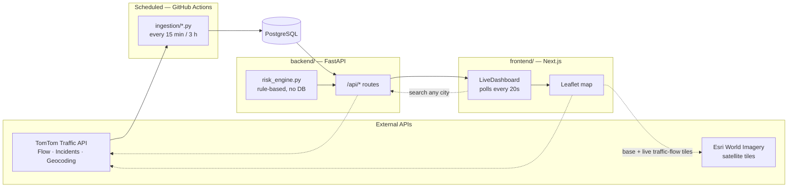
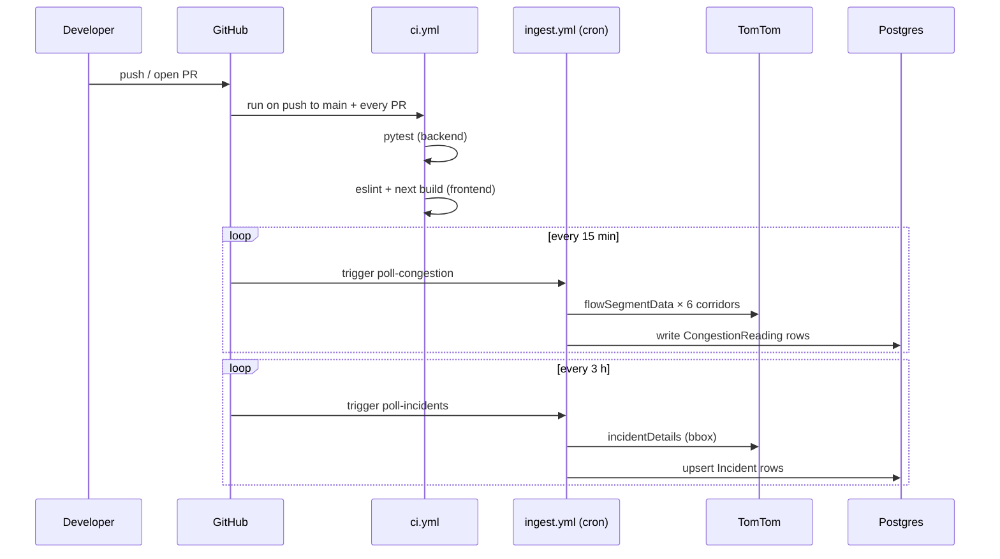

# Bengaluru Traffic Pulse

Root-cause analysis and live congestion tracking for Bengaluru's recurring festival-weekend
gridlock — grounded in [the Sep 11, 2026 exodus](data/case_study_sep11_2026.md), when a
second-Saturday + Sunday + Ganesh Chaturthi combination gridlocked every major exit corridor
from ~5 PM onward.

The project has three parts:

- **`backend/`** — FastAPI + Postgres. Serves live corridor congestion, active incidents, a
  rule-based risk calendar, the case study, and a solutions list at `/api/*`.
- **`ingestion/`** — standalone scripts that poll TomTom's Traffic API and write into the same
  Postgres database. Run on a schedule by `.github/workflows/ingest.yml`, not as a long-lived
  process.
- **`frontend/`** — Next.js dashboard that renders all of the above.

`data/` holds the evidence the backend and ingestion scripts read at runtime: corridor
coordinates, the Karnataka holiday calendar, and the case study itself — see
[`data/corridors.json`](data/corridors.json) for sourcing on each corridor.

## Tech stack

| Layer | Choices |
|---|---|
| **Backend** | Python, FastAPI, SQLAlchemy 2.0, Pydantic v2 / pydantic-settings, PostgreSQL, httpx, pytest |
| **Frontend** | Next.js 16 (App Router, Turbopack), React 19, TypeScript, Tailwind CSS v4, Leaflet / react-leaflet, lucide-react |
| **Ingestion** | Standalone Python scripts sharing the backend's models (`_bootstrap.py`), TomTom Traffic API (Flow Segment Data, Incident Details, Geocoding) |
| **Infra** | Docker Compose (local Postgres + backend image), GitHub Actions (CI + scheduled ingestion), Esri World Imagery (satellite tiles), TomTom traffic-flow tiles |

## Architecture



Three request paths worth knowing:

1. **Scheduled writes** — `ingestion/poll_congestion.py` / `poll_incidents.py` run on a GitHub Actions
   cron, hit TomTom, and write into Postgres. The backend never calls TomTom for the six pinned
   corridors; it only ever reads what ingestion already wrote.
2. **Live pass-through** — `/api/congestion/search` (the "check any location" box) skips the
   database entirely: geocode the query, fetch that point's current flow, return it. Nothing
   persists, so it doesn't compete with ingestion's TomTom quota budget.
3. **Direct-to-browser tiles** — the satellite base layer and the live traffic-flow overlay are
   requested by the browser directly from Esri/TomTom, not proxied through the backend (hence
   `NEXT_PUBLIC_TOMTOM_API_KEY` — see [`frontend/README.md`](frontend/README.md)).

## Running locally

```bash
cp .env.example .env          # DATABASE_URL, TOMTOM_API_KEY, CORS_ORIGINS
docker compose up -d db       # Postgres on localhost:5433 (see docker-compose.yml)

cd backend
pip install -r requirements.txt
uvicorn app.main:app --reload --port 8000

cd ../frontend
cp .env.example .env.local    # NEXT_PUBLIC_API_BASE_URL=http://localhost:8000
npm install
npm run dev                   # http://localhost:3000
```

A free TomTom API key (no credit card) is at https://developer.tomtom.com. Without one, the
dashboard still runs — corridors show "No readings yet" and incidents show empty — but nothing
will populate until ingestion runs successfully at least once:

```bash
cd ingestion
pip install -r requirements.txt
python poll_congestion.py     # ~6 requests, one per corridor
python poll_incidents.py      # 1 request, bbox around all corridors
```

## Workflows

Two GitHub Actions workflows run this project once it's on GitHub with `DATABASE_URL` and
`TOMTOM_API_KEY` set as repo secrets:



- **CI** (`.github/workflows/ci.yml`) — backend tests (`pytest`) and a frontend lint + production
  build, on every push to `main` and on PRs. Nothing merges without both passing.
- **Ingestion** (`.github/workflows/ingest.yml`) — two independent schedules in one workflow file,
  sized to TomTom's free-tier quotas (Flow Segment Data ~20K/month, Incident Details ~2.5K/month).
  GitHub disables scheduled workflows after 60 days of repo inactivity — push any commit to
  re-enable.

### Deployment

- **Database**: any Postgres works locally (`docker-compose.yml`); in production point
  `DATABASE_URL` at a hosted instance (e.g. Neon/Supabase — see `.env.example`).
- **Backend**: `backend/Dockerfile` builds a standalone image (build context is the repo root,
  since it also copies in `data/`).
- **Frontend**: any Next.js host (Vercel, etc.) — set `NEXT_PUBLIC_API_BASE_URL` to the deployed
  backend's URL, and optionally `NEXT_PUBLIC_TOMTOM_API_KEY` for the live traffic-flow map layer.

## Why rule-based, not ML

[`risk_engine.py`](backend/app/services/risk_engine.py) is a transparent, auditable rule set
derived directly from the case study and the published holiday calendar — there isn't yet
enough live ingestion history across multiple festival weekends to fit a model on. Once there
is, replacing it is the natural next step.
